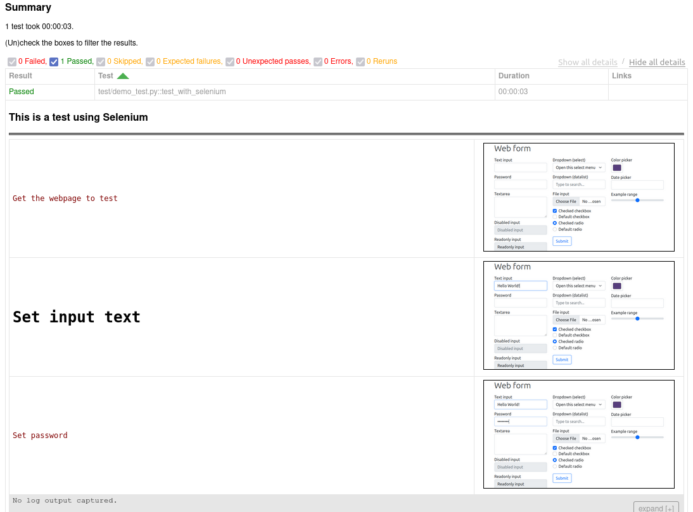
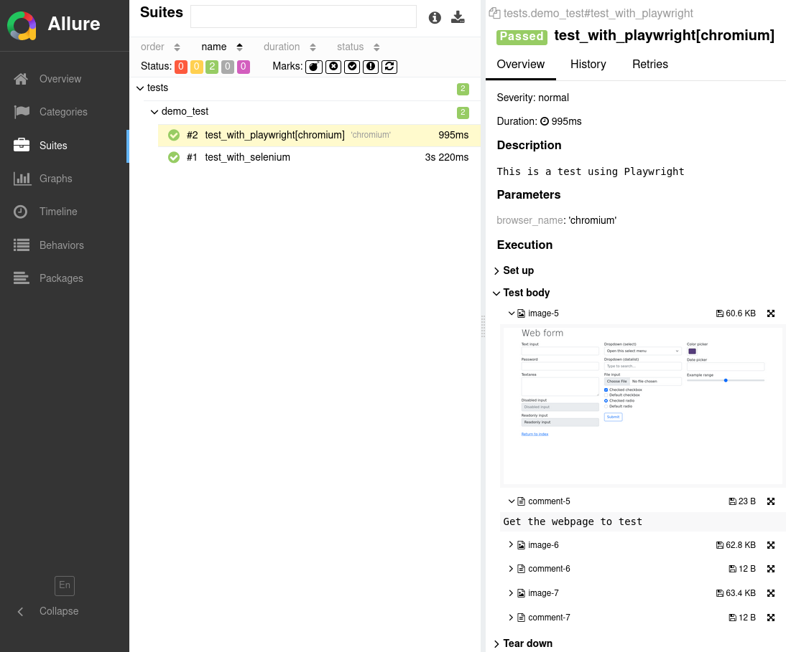

=====
Usage
=====

Options
=======

These are the options that can be added to the ``pytest.ini`` file.

----

* ``extras_screenshots``

The screenshots to add in the report.

Accepted values:

* ``all``:    Include all gathered screenshots in the report.

* ``last``:   Include only the last screenshot of each test in the report.

* ``none``:   No screenshots will be included in the report.

Default value: ``all``

----

* ``extras_comments``

Whether to include gathered comments in the report.

Default value: ``False``

----

* ``extras_sources``

Whether to include gathered webpage sources in the report.

Default value: ``False``

----

* ``extras_allure``

Whether to include the same extra HTML content in the Allure report.

Default value: ``False``

----

* **extras_description_tag**

The HTML tag for the test description (test docstring).

Accepted values: ``h1``, ``h2``, ``h3``, ``p`` or ``pre``

Default value: ``h2``

API
===

The function scoped fixture ``report_extras`` provides the following methods:

.. code-block:: python

  save_screenshot_for_selenium(
      driver: WebDriver,
      comment: str = None,
      full_page: bool = True
      escape_html: bool = True  # Whether to escape HTML characters in the comment.
  )
  
  save_screenshot_for_playwright(
      page: Page,
      comment: str = None,
      full_page: bool = True,
      escape_html: bool = True
  )
  
  save_screenshot(
      image: bytes | str,  # The screenshot as bytes or base64 string.
      comment: str = None,
      source: str = None,  # The webpage source
      escape_html: bool = True
  )

Limitations
===========

No support for any kind of parallel tests execution (multi-treads, multi-tabs or multi-windows).

For **Playwright**, only ``sync_api`` is supported.

Example
=======

| **pytest-webtest-extras** needs to be executed in conjunction of **pytest-html** plugin.
| Therefore, the ``--html`` option also needs to be provided.

An external CSS file needs be provided by using the **pytest-html** ``--css`` command-line option.

Command-line invocation
-----------------------

.. code-block:: bash

  pytest --html=/path/to/report --css=/path/to/css

If using Allure report:

.. code-block:: bash

  pytest --html=/path/to/report --css=/path/to/css --alluredir allure-results

Sample ``pytest.ini`` file
--------------------------

.. code-block:: ini

  extras_screenshots = all
  extras_comments = True
  extras_sources = False
  extras_allure = False

Sample code
-----------

* Example using Selenium

.. code-block:: python

  def test_with_selenium(report_extras):
      """
      This is a test using Selenium
      """
      driver = WebDriver_Chrome()
      driver.get("https://www.selenium.dev/selenium/web/web-form.html")
      report_extras.save_screenshot_for_selenium(driver, "Get the webpage to test", full_page=False)
      driver.find_element(By.ID, "my-text-id").send_keys("Hello World!")
      report_extras.save_screenshot_for_selenium(driver, "<h1>Set input text</h1>", escape_html=False)
      driver.find_element(By.NAME, "my-password").send_keys("password")
      report_extras.save_screenshot_for_selenium(driver, "Set password")
      driver.quit()

* Example using Playwright

.. code-block:: python

  def test_with_playwright(page: Page, report_extras):
      """
      This is a test using Playwright
      """
      page.goto("https://www.selenium.dev/selenium/web/web-form.html")
      report_extras.save_screenshot_for_playwright(page, comment="Get the webpage to test")
      page.get_by_label("Text input").fill("Hello World!")
      report_extras.save_screenshot_for_playwright(page, "Hello World!")
      page.get_by_label("Password").fill("password")
      report_extras.save_screenshot_for_playwright(page, "Set password")

Sample CSS file
===============

.. code-block:: css

  .extras_separator {
      height:2px;
      background-color: gray;
      /* display: none; */
  }

  .extras_td {
      width: 320px;
      /* text-align: center; */
  }

  .extras_td_div {
      text-align: center;
  }

  .extras_div {
      display: inline-block;
      text-align: center;
  }

  .extras_page_src {
      font-size: 12px;
      color: #999;
  }

  .extras_exception_name {
      color: black;
  }

  .extras_log_comment {
      font-family: monospace;
      color: maroon;
  }

  .extras_log_quote {
      font-weight: bold;
      color: black;
  }

  .extras_log_img {
      border: 1px solid black;
      width: 300px;
      height: 170px;
      object-fit: cover;
      object-position: top;
  }

Sample reports
==============

* Pytest sample report

* Allure sample report

